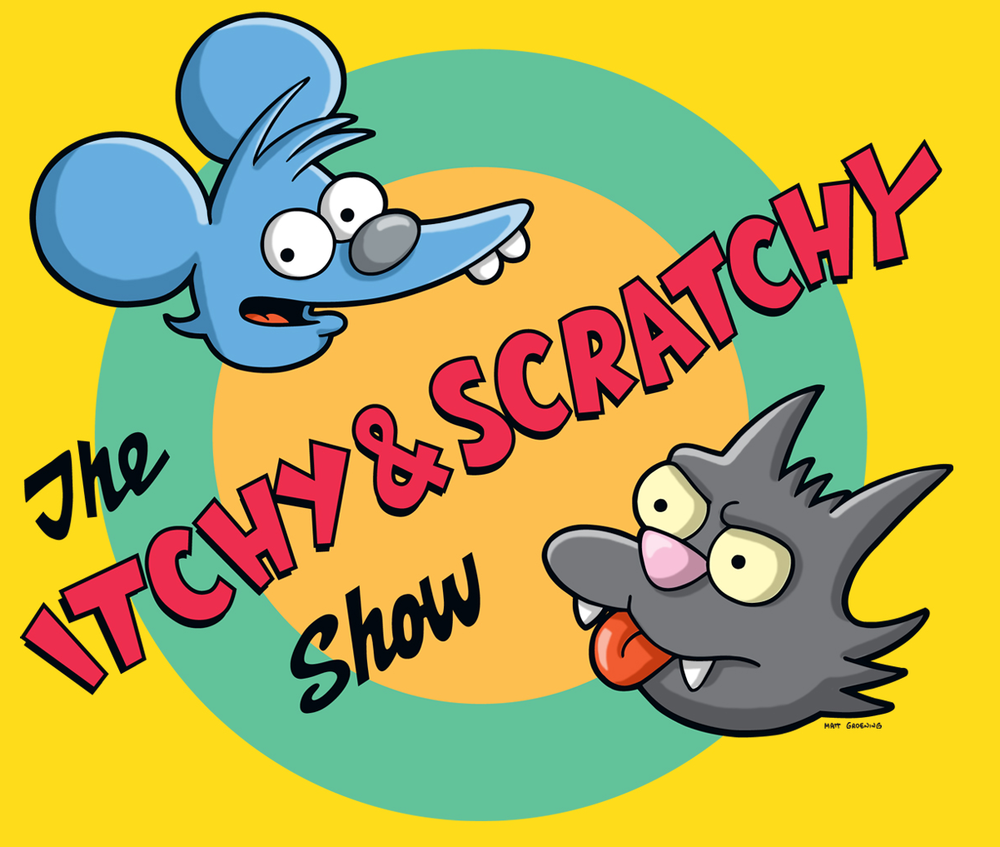

[%notitle]
:imagesdir: images
:revealjs_theme: sky
:revealjs_transition: fade

=== Greach
image::greach.png[canvas, size=contain]

== It's a bird... It's a plane... It's...

[%notitle]
=== SDKMAN!
image::sdkman.svg[canvas, size=auto]

== About Me

*Marco Vermeulen*

* Polyglot & JVM Enthusiast
* Using Kotlin, Java, Groovy, Scala and Go
* Consulting in London & Barcelona
* Working with https://codurance.com[Codurance] at https://shop.mango.com[Mango]
* Creator of https://sdkman.io[SDKMAN!]
* Twitter https://twitter.com/marc0der[@marc0der]

[%notitle]
=== Codurance
image::codurance.jpg[canvas, size=contain]

== About the Talk

* Problem and Solution
* What is an SDK?
* Architecture
* Infrastructure
* Vendoring
* Contribution
* Future
* http://bit.ly/sdkman-its-a-bird

== DEMO!!!

== SDK WTF?

=== What is an SDK?

[%step]
* archive: `.zip` or `.tar.gz`
* containing folder: `${name}-${version}/`
* unix folder sub-structure: `/bin`, `/lib`, `/etc` etc.
* self contained

[%notitle]
=== What is an SDK?
[source,bash]
----
$ unzip springboot-2.1.3.RELEASE.zip

Archive:  springboot-2.1.3.RELEASE.zip
   creating: spring-2.1.3.RELEASE/
   creating: spring-2.1.3.RELEASE/lib/
   creating: spring-2.1.3.RELEASE/bin/
   creating: spring-2.1.3.RELEASE/legal/
   creating: spring-2.1.3.RELEASE/shell-completion/
   creating: spring-2.1.3.RELEASE/shell-completion/bash/
   creating: spring-2.1.3.RELEASE/shell-completion/zsh/
   ...

$ tree spring-2.1.3.RELEASE

spring-2.1.3.RELEASE
├── bin
│   ├── spring
│   └── spring.bat
├── INSTALL.txt
├── legal
│   └── open_source_licenses.txt
├── lib
│   └── spring-boot-cli-2.1.3.RELEASE.jar
├── LICENCE.txt
└── shell-completion
    └── zsh
        └── _spring
6 directories, 8 files
----

=== What is a Package?

[%step]
* artifact: `.deb`, `.rpm`, `.dmg`, `.pkg`, `.msi`, `.exe`
* complex folder structure
* internal descriptors, scripts
* custom for distro, platform
* external dependencies

=== Package or SDK Manager?

[%notitle]
== Itchy Scratchy

=== Itch

[%step]
* Working with many SDKs
* Downloading SDKs
* Extracting SDKs
* Manage many `_HOME` variables
* Adding these to `PATH`
* Simlinks to switch versions
* A Mundane Task!
* *A Pain in the Ass!!*

=== Scratch

[%step]
* An SDK Manager
* Install multiple Candidates
* Multiple Versions per Candidate
* Performs Downloads
* Deals with Archives
* Handle `_HOME` and `PATH` variables
* Always up to date
* Runs anywhere

== Command Line Interface
image::cli.jpg[canvas, size=cover]

=== Why in bash?
[%step]
* Light weight
* Fast startup (no Java)
* Many platforms (OSX, Linux, Cygwin, Solaris, BSD)
* No dependencies (only Curl, Zip)

=== Bash Client: Bootstrap 

.~/.bashrc
[source,bash]
----
#THIS MUST BE AT THE END OF THE FILE FOR SDKMAN TO WORK!!!
[[ -s "/home/muppet/.sdkman/bin/sdkman-init.sh" ]]
    && source "/home/muppet/.sdkman/bin/sdkman-init.sh"
----

=== Bash Client: Bootstrap 

.~/.sdkman/bin/sdkman-init.sh
[source,bash]
----
# Source sdkman module scripts.               
for f in $(find "${SDKMAN_DIR}/src" -type f -name 'sdkman-*');
do
  source "${f}"                                 
done
----

=== Bash Client: Bootstrap 

.~/.sdkman/src/sdkman-help.sh
[source,bash]
----
function __sdk_help {
  __sdkman_echo_no_colour ""
  __sdkman_echo_no_colour "Usage: sdk <command> [candidate] [version]"
  __sdkman_echo_no_colour "       sdk offline <enable|disable>"
  ...
}
----

=== Bash Client: Bootstrap

.~/.sdkman/src/sdkman-main.sh`
[source,bash]
----
function sdk {                                    
  COMMAND="$1"                                  
  QUALIFIER="$2"                                
  CMD_FOUND=""
  CMD_TARGET="${SDKMAN_DIR}/src/sdkman-${COMMAND}.sh"
  if [[ -f "$CMD_TARGET" ]]; then               
    CMD_FOUND="$CMD_TARGET"                   
  fi
  CONVERTED_CMD_NAME=$(echo "$COMMAND" | tr '-' '_') 
  if [ -n "$CMD_FOUND" ]; then                    
    # It's available as a shell function          
    __sdk_"$CONVERTED_CMD_NAME" "$QUALIFIER" "$3" "$4"
  fi
}   
----

[%notitle]
=== Looks good, but it's like building on Quicksand!
image::quicksand.jpg[canvas, size=cover]

=== Why use Native instead?
[%step]
* Consistent behaviour
* Runs on LLVM
* Multi platform
* No dependencies _at all_
* Powerful standard libs

== The Backend
image::backend.jpg[canvas, size=cover]

=== Backend Architecture

* Microservices
* Docker
* NGINX
* MongoDB
* Postgres

=== API Services

* Proxy Service
* https://github.com/sdkman/sdkman-candidates[Candidate Service]
* https://github.com/sdkman/sdkman-hooks[Hooks Service]
* https://github.com/sdkman/sdkman-broker[Broker Service]
* https://github.com/sdkman/sdkman-candidates[Broadcast Service]

=== Infrastructure

* Digital Ocean
* Docker Hub
* Terraform
* Ansible
* Kubernetes?

== Vendoring

* Vendor APIs
* https://github.com/sdkman/sdkman-vendor-gradle-plugin[SDKMAN Vendor Gradle Plugin]
* https://github.com/sdkman/sdkman-vendor-maven-plugin[SDKMAN Vendor MVN Plugin]
* https://github.com/sdkman/sdkman-db-migrations[Database Migrations]

[%notitle]
== Contributing
image::uncle-sam.jpg[canvas, size=contain]

=== Contributing

* https://trello.com/b/mQLHVahc/sdkman-dev-board[Trello Board]
* https://github.com/sdkman/sdkman-cli/issues[Github Issues]
* https://github.com/sdkman/sdkman-cli/blob/master/CONTRIBUTING.md[Contributor Guidelines]
* https://gitter.im/sdkman/user-issues[Gitter user-issues]
* https://github.com/sdkman/sdkman-db-migrations[Database Migrations]

[%notitle]
== What does the future hold?
image::future.jpg[canvas, size=contain]

=== Native Rewrite

* bash wrapper
* small iterations
* use cucumber features
* fully feature compliant
* Native CLI will speak JSON
* release v3 JSON API
* offline by default! (like apt or git)

=== Java Candidate

* custom list view
* JVM vendor namespace
* hooks backend migrate to Go CLI?

=== New Features

* Official Docker images (https://github.com/sdkman/sdkman-cli/issues/375[Issue #375])
* Major version alias (https://github.com/sdkman/sdkman-cli/issues/603[Issue #603])
* System installation fallback (https://github.com/sdkman/sdkman-cli/issues/673[Issue #673])
* Per project SDK configuration (https://github.com/sdkman/sdkman-cli/issues/683[Issue #683])
* Offer available version when version ommitted (https://github.com/sdkman/sdkman-cli/issues/689[Issue #689])
* Clean up commands (https://github.com/sdkman/sdkman-cli/issues/688[Issue #688])

== Thank You!

== Q & A

[%notitle]
== Feedback

image::evaluation_qr.png[]

Please provide your Feedback!
https://greach.contestia.es
