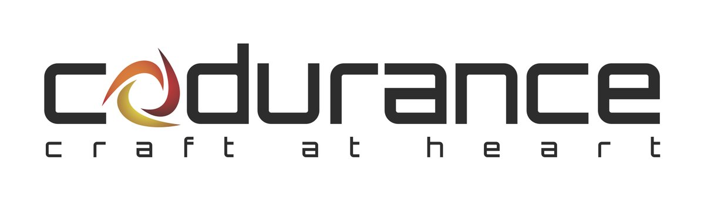
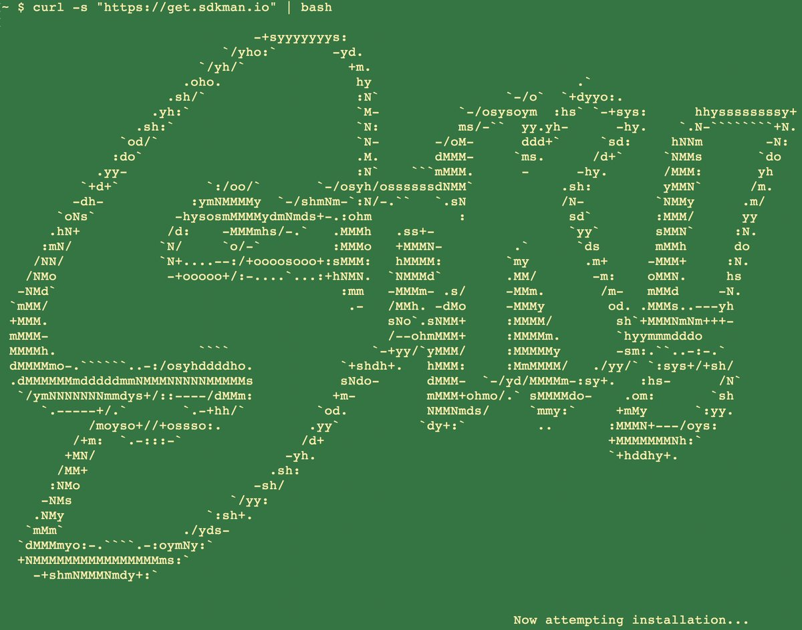

# It's a bird... It's a plane... It's...

---

# SDKMAN!


---

# About Me

*Marco Vermeulen*

* Polyglot & JVM Enthusiast
* Using Kotlin, Java, Groovy, Scala and Go
* Consulting in London & Barcelona
* Working with [Codurance](https://codurance.com) at [Mango](https://shop.mango.com)
* Creator of [SDKMAN!](https://sdkman.io)
* Twitter [@marc0der](https://twitter.com/marc0der)

---

# Codurance



---

# About the Talk

* Problem and Solution
* What is an SDK?
* Architecture
* Infrastructure
* Vendoring
* Contribution
* Future
* [Slides](http://bit.ly/sdkman-its-a-bird)

---

# DEMO!!!

---

# SDK WTF?


--- 

# What is an SDK?

* archive: `.zip` or `.tar.gz`
* containing folder: `${name}-${version}/`
* unix folder sub-structure: `/bin`, `/lib`, `/etc` etc.
* self contained

---

# What is an SDK?

---

```bash
$ unzip springboot-2.1.3.RELEASE.zip

Archive:  springboot-2.1.3.RELEASE.zip
   creating: spring-2.1.3.RELEASE/
   creating: spring-2.1.3.RELEASE/lib/
   creating: spring-2.1.3.RELEASE/bin/
   creating: spring-2.1.3.RELEASE/legal/
   creating: spring-2.1.3.RELEASE/shell-completion/
   creating: spring-2.1.3.RELEASE/shell-completion/bash/
   creating: spring-2.1.3.RELEASE/shell-completion/zsh/
   ...
```

---

```bash
$ tree spring-2.1.3.RELEASE

spring-2.1.3.RELEASE
├── bin
│   ├── spring
│   └── spring.bat
├── INSTALL.txt
├── legal
│   └── open_source_licenses.txt
├── lib
│   └── spring-boot-cli-2.1.3.RELEASE.jar
├── LICENCE.txt
└── shell-completion
    └── zsh
        └── _spring
6 directories, 8 files
```

---

# What is a Package?

* artifact: `.deb`, `.rpm`, `.dmg`, `.pkg`, `.msi`, `.exe`
* complex folder structure
* internal descriptors, scripts
* custom for distro, platform
* external dependencies

---

# Package or SDK Manager?

---

# Itchy Scratchy


---

# Itch

* Working with many SDKs
* Downloading SDKs
* Extracting SDKs
* Manage many `_HOME` variables
* Adding these to `PATH`
* Simlinks to switch versions
* A Mundane Task!
* *A Pain in the Ass!!*

---

# Scratch

* An SDK Manager
* Install multiple Candidates
* Multiple Versions per Candidate
* Performs Downloads
* Deals with Archives
* Handle `_HOME` and `PATH` variables
* Always up to date
* Runs anywhere

---

# Command Line Interface



---

# Why in bash?
[%step]
* Light weight
* Fast startup (no Java)
* Many platforms (OSX, Linux, Cygwin, Solaris, BSD)
* No dependencies (only Curl, Zip)

---

# Bash Client: Bootstrap 

`.~/.bashrc`

```bash
#THIS MUST BE AT THE END OF THE FILE FOR SDKMAN TO WORK!!!
[[ -s "/home/muppet/.sdkman/bin/sdkman-init.sh" ]]
    && source "/home/muppet/.sdkman/bin/sdkman-init.sh"
```

---

# Bash Client: Bootstrap 

`.~/.sdkman/bin/sdkman-init.sh`

```bash
# Source sdkman module scripts.               
for f in $(find "${SDKMAN_DIR}/src" -type f -name 'sdkman-*');
do
  source "${f}"                                 
done
----

=== Bash Client: Bootstrap 

.~/.sdkman/src/sdkman-help.sh
[source,bash]
----
function __sdk_help {
  __sdkman_echo_no_colour ""
  __sdkman_echo_no_colour "Usage: sdk <command> [candidate] [version]"
  __sdkman_echo_no_colour "       sdk offline <enable|disable>"
  ...
}
```

---

# Bash Client: Bootstrap

`.~/.sdkman/src/sdkman-main.sh`

```bash
function sdk {                                    
  COMMAND="$1"                                  
  QUALIFIER="$2"                                
  CMD_FOUND=""
  CMD_TARGET="${SDKMAN_DIR}/src/sdkman-${COMMAND}.sh"
  if [[ -f "$CMD_TARGET" ]]; then               
    CMD_FOUND="$CMD_TARGET"                   
  fi
  CONVERTED_CMD_NAME=$(echo "$COMMAND" | tr '-' '_') 
  if [ -n "$CMD_FOUND" ]; then                    
    # It's available as a shell function          
    __sdk_"$CONVERTED_CMD_NAME" "$QUALIFIER" "$3" "$4"
  fi
}   
```

---

# Looks good, but it's like building on Quicksand!


---

# Why use Native instead?

* Consistent behaviour
* Runs on LLVM
* Multi platform
* No dependencies _at all_
* Powerful standard libs

---

# The Backend


---

# Backend Architecture

* Microservices
* Docker
* NGINX
* MongoDB
* Postgres

---

# API Services

* Proxy Service
* [Candidate Service](https://github.com/sdkman/sdkman-candidates)
* [Hooks Service](https://github.com/sdkman/sdkman-hooks)
* [Broker Service](https://github.com/sdkman/sdkman-broker)
* [Broadcast Service](https://github.com/sdkman/sdkman-candidates)

---

# Infrastructure

* Digital Ocean
* Docker Hub
* Terraform
* Ansible
* Kubernetes?

---

# Vendoring

* Vendor APIs
* [SDKMAN Vendor Gradle Plugin](https://github.com/sdkman/sdkman-vendor-gradle-plugin)
* [SDKMAN Vendor MVN Plugin](https://github.com/sdkman/sdkman-vendor-maven-plugin)
* [Database Migrations](https://github.com/sdkman/sdkman-db-migrations)

---

# Contributing


---

# Contributing

* [Trello Board](https://trello.com/b/mQLHVahc/sdkman-dev-board)
* [Github Issues](https://github.com/sdkman/sdkman-cli/issues)
* [Contributor Guidelines](https://github.com/sdkman/sdkman-cli/blob/master/CONTRIBUTING.md)
* [Gitter user-issues](https://gitter.im/sdkman/user-issues)
* [Database Migrations](https://github.com/sdkman/sdkman-db-migrations)

---

# What does the future hold?


---

# Native Rewrite

* bash wrapper
* small iterations
* use cucumber features
* fully feature compliant
* Native CLI will speak JSON
* release v3 JSON API
* offline by default! (like apt or git)

---

# Java Candidate

* custom list view
* JVM vendor namespace
* hooks backend migrate to Go CLI?

---

# New Features

* Official Docker images [Issue #375](https://github.com/sdkman/sdkman-cli/issues/375)
* Major version alias [Issue #603](https://github.com/sdkman/sdkman-cli/issues/603)
* System installation fallback [Issue #673](https://github.com/sdkman/sdkman-cli/issues/673)
* Per project SDK configuration [Issue #683](https://github.com/sdkman/sdkman-cli/issues/683)
* Offer available version when version ommitted [Issue #689](https://github.com/sdkman/sdkman-cli/issues/689)
* Clean up commands [Issue #688](https://github.com/sdkman/sdkman-cli/issues/688)

---

# Thank You!

---

# Q & A

---

# Feedback


Please provide your Feedback!
https://greach.contestia.es
